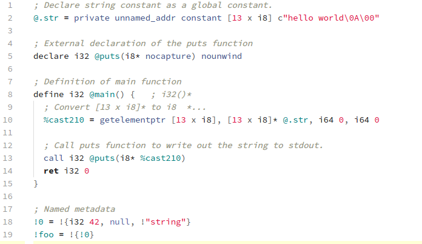

# language-llvm-ir package

Support for LLVM's Intermediate Representation language in Atom

##### Example with Seti UI and AtomLight

##### Example with Seti UI and OneDark

## License

This package is provided under the terms of the MIT License. See the file **LICENSE** for more details.
